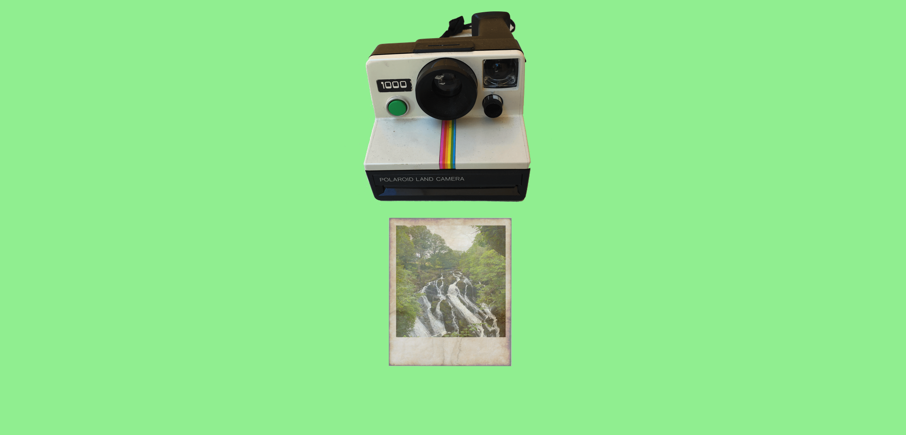

# Day 2
## Prompt: "Create something that ages"

I tried not to spend too long on this day, as at first I didn't think it was a good enough prompt to warrant hours and hours being spent on it. It ended up taking longer than I anticipated due to having to create assets, however basic they turned out looking. Originally, I was going be a comedian and have the word "something" growing a grey beard and dying, though when I had the final idea of the polaroid ageing, the former seemed much less funny. All the motion is implemented in CSS animations, with a small amount of JavaScript to control and loop timings.

I'm happy with how this turned out relative to how much time I put into it. I think it's rather creative, if I do say so myself.

