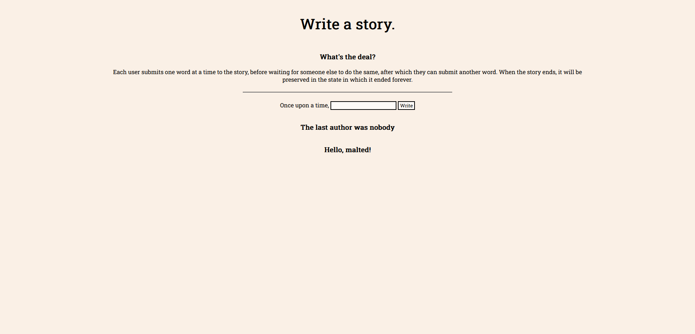

# Day 3
## Prompt: "Write a story"

This is the first day I have failed to get to a complete, finished state. To be fair, it is using Replit Auth, so that pretty much explains why it doesn't work and the reason I'm going to stick to. It's not a skill issue. I could rant about how it's impractical and inviable for actual endpoint authentication, or how using public data as authentication, is not in fact, authentication, but I won't. This is using Flask on Python, because that's what the Replit Auth example was using. It's using Repl DB to store the story so far, and the last word's author's username and ID because it's very simple to use. I will admit I do like it a tad.

Overall I think this is an interesting idea, and will most likely recreate in a better language and not using Replit Auth after this month.

